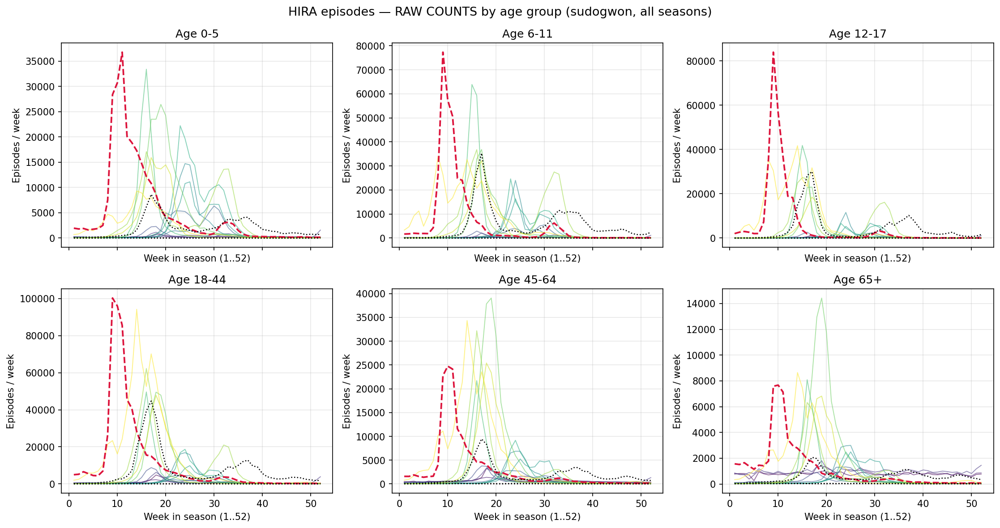
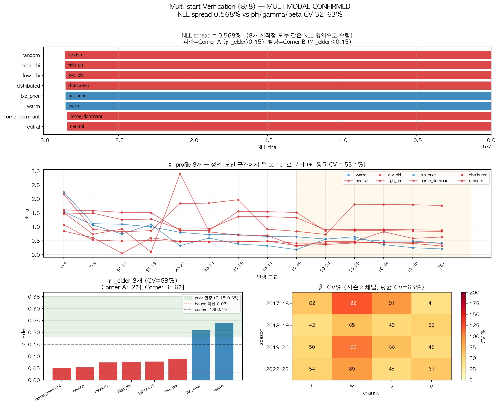
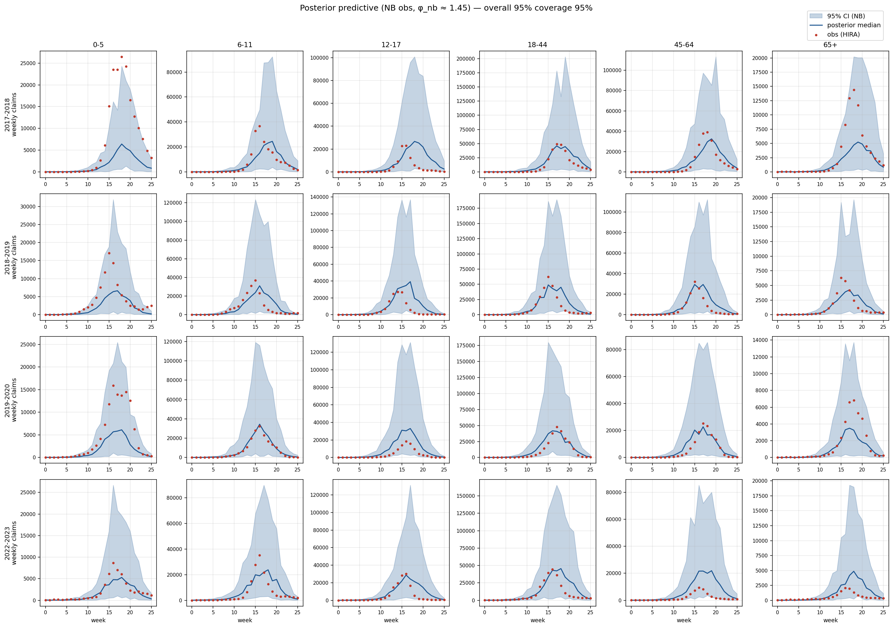

<!-- _class: lead -->
<!-- _paginate: false -->

# 수도권 인플루엔자 모델 Calibration
## 모수 식별성 — 진단·해결·결과

조현우
데이터: 국민건강보험공단 J09–J11 진료에피소드 (2018–2024)

**2026년 6월**

---

# 1. 연구 맥락

**정책 목표**: 정상 시기 인플루엔자 sick-leave / 학교 결석 정책의 ICER

**모델**:
- SVEIR (S → V → E → I → R) + 4-channel FOI (가정 / 직장 / 학교 / 기타)
- 연령 NIMS 15군 (5세 단위)
- 수도권 (서울 + 인천 + 경기), 4 정상 시즌

**데이터**: HIRA J09–J11 진료에피소드, 6 연령군

HIRA 의 장점:
- **카운트 단위** (인구 분모 깨끗)
- γ_report 해석이 명확 ("감염자 중 청구 비율")

---

# 2. γ_report 다시 — 탐지율의 의미

**정의**: 실제 감염자 중 HIRA 진료 청구로 잡힌 비율

$$
\gamma_{\text{report}} = \frac{\text{청구 카운트}}{\text{실제 감염자}}
$$

**빙산 비유**:
- 보이는 부분 = HIRA 청구 (분자, 측정 가능)
- 숨은 부분 = 무증상 + 자가관리 + 미진료 (분모, 측정 불가)

**γ = level × 연령 상대비**:
- **level**: Jung et al. (2025) q = 0.67 (감염 → 증상) 에서 무증상·미청구 제외 → **0.6** (비식별 anchor, R0 흡수 차원)
- **연령 상대비**: 데이터가 식별 가능한 차원 (sweep 에서 CDC 비율 NLL 최저 확인)

| 연령군 | CDC 상대비 | γ (level 0.6 적용) |
|---|---|---|
| 어린이 | **1.45** | 0.87 |
| 성인 | **0.65** | 0.39 |
| 노인 | **0.90** | 0.54 |

---

# 3. 식별성 문제 — 곱셈의 함정

**모델 관측 신호**:

$$
\text{청구 카운트} \;\propto\; \beta \times \phi \times \gamma \times s(t)
$$

**두 시나리오, 같은 청구**:

| | 시나리오 A | 시나리오 B |
|---|---|---|
| 실제 감염 (β·φ) | 100 | 250 |
| 탐지율 (γ) | 0.25 | 0.10 |
| **HIRA 청구** | **25** | **25** |

데이터만 보면 A 와 B 구분 불가 — **구조적 비식별**

**핵심**: 데이터를 더 모아도 **곱** 만 결정될 뿐 개별 분해 불가.
모델 구조 자체의 성질.

---

# 4. 진단 — Multi-start 가 보여준 다봉성

**검증**: 8개 시작점 multi-start (warm / bio_prior / 극단 / 무작위 등)

| 지표 | 값 | 의미 |
|---|---|---|
| NLL spread | **0.57%** | 8개 fit 거의 동일 적합 |
| φ 평균 CV | **53%** | 같은 NLL 위에 여러 mode |
| γ_elder CV | **63%** | 분해 자유도 큼 |
| β 평균 CV | **65%** | channel split swap |

---

같은 데이터 fit, 다른 (β, φ, γ) — **곱은 식별, 분해는 안 됨**

---

# 5. R(0) 연령 구조 누락

**2019-2020 시즌 fit**:

| Test | 결과 | 의미 |
|---|---|---|
| 65+ peak ratio (pred/obs) | **1.43** | 노인 구조적 과대 |
| 65+ raw attack rate | 7.5% (정상) | 감염 수준 자체는 적절 |
| 다른 5 연령 fit | 0.63 – 1.11 | 65+ 만 outlier |

**원인 추적**:
1. R(0) (초기 면역) = **균일 30%** (전 연령 동일)
2. 그러나 노인 실제 면역 (이전 시즌 누적) >> 30%
3. → 노인 S 모집단 **과대**, I 과대생성
4. → 데이터 fit 위해 γ_elder 가 흡수 (0.25 → 0.05 corner)

**모델 내부 단순화 문제** — 외부 데이터가 흡수 → 수정 가능

---

# 6. 해결 ① — R(0) 계단 형식

**변경**: 균일 30% → 연령 계단

| 연령군 | R(0) 기존 | R(0) **계단** | 근거 |
|---|---|---|---|
| 0–19 | 0.30 | **0.10** | 최근 시즌 노출 적음 + 백신 coverage 낮음 |
| 20–49 | 0.30 | **0.30** | 기준 |
| 50–64 | 0.30 | **0.45** | 누적 노출 + 백신 |
| 65+ | 0.30 | **0.65** | 백신 정책 + 누적 면역 |

**근거**: POLYMOD 이전 시즌 누적 + Vandegrift 2010 미국 추정

**효과**:
- 65+ peak ratio **1.43 → 0.99** 
- γ_elder CDC band 안: 2/8 → 7/8 시작점
- γ_elder CV: 63% → 25%

---

# 7. 해결 ② — 추정 대상 분리

곱 **β · φ · γ** 중 어느 차원을 데이터로 결정할 수 있나?

| 파라미터 | 의미 | 데이터 정보량 | 결정 방법 |
|---|---|---|---|
| **γ_report** | 탐지율 | **없음** (분모 미관측) | **외부 고정** (CDC + PSA) |
| **φ_age** | 연령별 감수성 | **약함** | **prior 좁게** (Cauchemez ±15%) |
| **β_channel** | 채널별 전파율 | **강함** (peak 시점·높이) | **데이터로 추정** (NUTS) |

**Reparam**: β·φ 곱셈 ridge → primary axis 를 **log R0** 로 회전
- log R0 (시즌별 4) + 채널 비율 (시즌별 4) + φ (14)
- β 는 (R0, 채널 비율, φ) 에서 NGM 역산으로 **derive**

---

# 8. 결과 ① R0 식별 (production NUTS, 채널 정상화)

**Production NUTS** (NB 관측모델 + 채널 정상화, 300 warmup + 300 sample × 4 chain, wall 64분)

| 시즌 | R0 mean | 95% CI |
|---|---|---|
| 2017–18 | **1.79** | [1.74, 1.83] |
| 2018–19 | **1.95** | [1.91, 1.98] |
| 2019–20 | **1.90** | [1.85, 1.95] |
| 2022–23 | **1.74** | [1.68, 1.84] |

 

**전체**: R0 mean **1.84**, range **[1.68, 1.98]** — 전형적 seasonal flu (1–2.5)
**수렴**: divergence **0/2400**, r_hat **1.007**, ess **908**

4 chain 일치 + 완벽 수렴 — R0 가 데이터로 식별되는 primary axis

---

# 8b. 결과 ①′ Posterior predictive — 연령별 fit (피드백 3)

**구성**: 4 시즌 × 6 HIRA 연령군. 빨간 점 = 관측 청구, 파란 선·띠 = posterior 중앙값 + 95% credible (parameter + **NB 관측 노이즈**)

**판독**:
- **95% coverage = 95.2%** (nominal 95% 와 일치) — 모든 시즌·연령
- 연령별 coverage: 0–5 89%, 6–11 99%, 12–17 92%, 18–44 99%, 45–64 99%, 65+ 93%
- 모든 panel에서 peak 시점·형태·진폭 재현

**모델 구조 (4채널 contact + 계단 R(0) + γ CDC + φ=1.0 + NB 관측) 가 데이터 재현**

---

# 8c. 결과 ①″ 관측모델: Poisson → NB

**문제**: Poisson 가정 (분산=평균) 으로는 청구 데이터 변동 못 잡음
- 주별 변동·보고 지연·요일 효과 → 실측 **분산 > 평균** (과분산)
- 결과: posterior 띠 좁음, coverage 12%, 거기에 수렴까지 악화 (r_hat 2.38)

**해법**: 관측을 **Negative Binomial-2** 로
$$\text{obs} \sim \text{NegBin}\!\left(\mu = \text{pred},\; \text{Var} = \mu + \mu^2/k\right)$$

**결과**:

| 지표 | Poisson | **NB** |
|---|---|---|
| 95% coverage | 12% | **95%** |
| r_hat max | 2.38 | **1.02** |
| ess_min | 5 | **581** |
| R0 mean | 1.96 | 1.90 (거의 동일) |
| wall | 6h 25min | **41분** |

**NB 분산 파라미터** `phi_nb = 1.44 [1.30, 1.59]` — 식별 (r_hat 1.02)

NB가 **coverage 와 수렴을 동시에 해결** — 좁은 Poisson likelihood 가 채널 mix ridge 에 chain 들을 가둔 것까지 풀림

---

# 8d. 결과 ①‴ 4 채널 전파 분해 — 비식별 진단 후 정상화

**시즌별 채널 mix** (NB + work:other 비율 고정):

| 시즌 | home | **work** | school | other |
|---|---|---|---|---|
| 2017–18 | 0.36 | **0.12** | 0.31 | 0.22 |
| 2018–19 | 0.23 | **0.11** | 0.45 | 0.21 |
| 2019–20 | 0.23 | **0.11** | 0.44 | 0.21 |
| 2022–23 | 0.27 | **0.15** | 0.30 | 0.28 |

**진단·해소된 3 종 비식별**:

| 증상 | 원인 | 외부 근거 해소 |
|---|---|---|
| home ≈ 0 | γ_adult 절대값 너무 높음 → home β 가 성인 보정 | **γ level = 0.6** (Jung q=0.67 − 무증상/미청구) × CDC 연령 상대비 |
| **work ≈ 0** | work/other 둘 다 성인 타겟 + HIRA 6 연령군 → 분해 정보 부족 | **work:other = 0.349 : 0.651** (NIMS 접촉 row-sum) 고정 |
| school 0.62 과대 | work 흡수 (둘 다 R0 ↑ 효율 비슷) | 위 두 해소로 자동 교정 (0.62 → 0.30–0.45) |

데이터가 보는 것(home/school/덩어리 크기) 추정 + 못 보는 것(분배·level) 외부 근거 → single-channel dominance 없음, 역학적으로 타당

**같은 sample 의 φ posterior**:

| chain | φ[0] (0–4세) | 해석 |
|---|---|---|
| 0 (warm) | 4.90 | |
| 1 (bio_prior) | 5.73 | chain 마다 |
| 2 (distributed) | 6.37 | 서로 다른 mode |
| 3 (home_dominant) | 6.62 | (ridge 위 다른 점) |

| 진단 | 값 | 의미 |
|---|---|---|
| φ posterior mean | 3.17 | prior median 1.0 무시 |
| φ near tail (>2.0) | **67%** | prior 와 무관 |
| r_hat (φ) | **4.46** | chain 분산 |
| ess (φ) | **5** | 거의 안 섞임 |

**슬라이드 8 의 "φ는 데이터 정보 약함" 진단을 데이터로 확정**
→ φ 외부 고정이 정당 (prior 좁힘 or 점추정)

---

# 10. 비식별 ridge → field knowledge로 결정

(현재) 데이터만으로는 γ·φ 를 정할 수 없다 (ridge)

- γ (탐지율): CDC reporting multiplier
- φ (연령 감수성): Cauchemez 등 문헌 범위 (±15%)
- β (전파력): 데이터로 추정 (R0)

---

# 11. 선행연구 대비 — Jung et al. (2025)

같은 데이터·모델 출발점, **다른 식별성 처리**

| 측면 | Jung et al. 2025 | 본 연구 |
|---|---|---|
| 데이터 | HIRA 인플루엔자 청구 | 동일 |
| 모델 | 연령별 SEIR | 동일 |
| 백신 | 한국 청소년·노인 정책 | 동일 |
| **식별성** | reporting q = 0.67 **단일값 우회** | 진단·분해·고정 + PSA |
| 정책 시뮬 | 백신 coverage 시나리오 | sick-leave 정책 (수도권 metapop) |
| 불확실성 정량 | 부분 | β·R0 posterior + γ·φ PSA |

**방법론적 기여**: identifiability 정면 진단·해결 + 출처 객체화 (γ_registry)

---

# 12. 현재 진행 + 향후

**현재 도달점** (완료):
- ✅ **β·R0 추정 완료** (NB + 채널 정상화 production, divergence 0, r_hat 1.007)
- ✅ **γ = level(0.6) × CDC 상대비** — Jung 2025 정합 + 데이터 식별 (객체화)
- ✅ **φ = 1.0 고정** (3중 비식별 확정 후, 점고정)
- ✅ **4 채널 mix 정상화** (home 0.27 / work 0.12 / school 0.40 / other 0.22)
- ✅ **Posterior predictive 95.2% coverage**

**식별성 정리** — 데이터가 보는 것 / 못 보는 것:

| 차원 | 정체 | 처리 |
|---|---|---|
| **R0 (β 스케일)** | 데이터 식별 (peak·진폭) | **NUTS 추정** ✅ |
| home / school / (work+other) 덩어리 | 연령 곡선이 식별 | **NUTS 추정** ✅ |
| γ level (전역 곱셈) | 비식별 (R0 흡수) | **0.6 anchor** (Jung) |
| γ 연령 상대비 | 데이터 식별 | **NUTS 검증 (sweep)** ✅ |
| **work : other 분배** | practical 비식별 (둘 다 성인) | **NIMS 접촉비 0.349 고정** |
| φ_age | 구조적 비식별 (v7b/v8/v9) | **1.0 점고정** |

**다음 (Stage 4–5)**:
1. **수도권 metapop 1,154 행정동 forward** — 정책 시나리오 (sick_leave / school_closure 등)
2. **민감도 분석** — work:other 비율 ([0.25, 0.35, 0.50]) → sick_leave 효과 robustness
3. **ICER + PSA** — γ_source 교체 + R0 posterior CI 펼침

---

<!-- _class: lead -->
<!-- _paginate: false -->

# 13. 요약

- **비식별을 차원별로 진단·해소**: 데이터가 보는 것은 추정, 못 보는 것은 외부 근거
- **R(0) 계단** → 노인 과대 + γ 흡수 해결 (1.43 → 0.99)
- **γ = 0.6 × CDC 상대비** (Jung q=0.67 정합), **φ = 1.0 점고정**
- **work : other = 0.349 : 0.651** (NIMS 접촉비) — 4 채널 mix 정상화
- **Production NB**: R0 1.84 [1.68, 1.98], r_hat 1.007, coverage 95.2%

