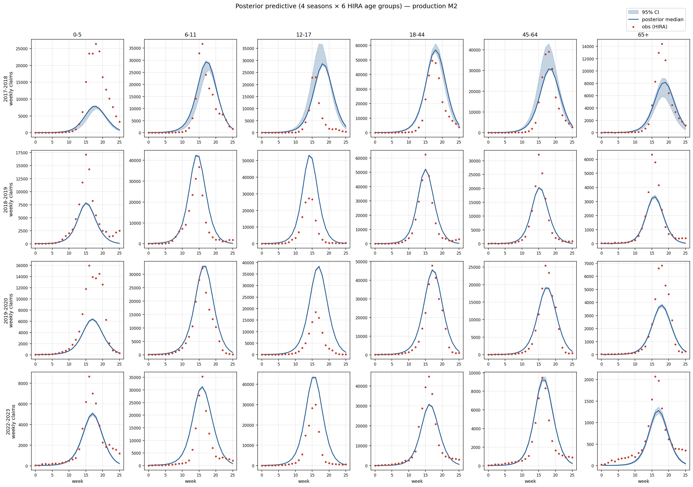

<!-- _class: lead -->
<!-- _paginate: false -->

# 수도권 인플루엔자 모델 Calibration
## 모수 식별성 — 진단·해결·결과

조현우
데이터: 국민건강보험공단 J09–J11 진료에피소드 (2018–2024)

**2026년 6월**

---

# 1. 연구 맥락

**정책 목표**: 정상 시기 인플루엔자 sick-leave / 학교 결석 정책의 ICER

**모델**:
- SVEIR (S → V → E → I → R) + 4-channel FOI (가정 / 직장 / 학교 / 기타)
- 연령 NIMS 15군 (5세 단위)
- 수도권 (서울 + 인천 + 경기), 4 정상 시즌

**데이터**: HIRA J09–J11 진료에피소드, 6 연령군

HIRA 의 장점:
- **카운트 단위** (인구 분모 깨끗)
- γ_report 해석이 명확 ("감염자 중 청구 비율")

---

# 2. γ_report 다시 — 탐지율의 의미

**정의**: 실제 감염자 중 HIRA 진료 청구로 잡힌 비율

$$
\gamma_{\text{report}} = \frac{\text{청구 카운트}}{\text{실제 감염자}}
$$

**빙산 비유**:
- 보이는 부분 = HIRA 청구 (분자, 측정 가능)
- 숨은 부분 = 무증상 + 자가관리 + 미진료 (분모, 측정 불가)

**노인 100명 감염, γ=0.25 가정**:
- 청구로 잡힘: **25명**
- 못 잡힘: **75명** (만성질환 혼재 / 자가관리 / 응급실 미경유)

| 연령군 | γ (CDC 2015) | 의미 |
|---|---|---|
| 어린이 | **0.40** | 부모가 데려옴 → 잘 잡힘 |
| 성인 | **0.18** | 자가관리 ↑ |
| 노인 | **0.25** | 합병증 동반진단 + 백신 효과 분리 |

---

# 3. 식별성 문제 — 곱셈의 함정

**모델 관측 신호**:

$$
\text{청구 카운트} \;\propto\; \beta \times \phi \times \gamma \times s(t)
$$

**두 시나리오, 같은 청구**:

| | 시나리오 A | 시나리오 B |
|---|---|---|
| 실제 감염 (β·φ) | 100 | 250 |
| 탐지율 (γ) | 0.25 | 0.10 |
| **HIRA 청구** | **25** | **25** |

데이터만 보면 A 와 B 구분 불가 — **구조적 비식별**

**핵심**: 데이터를 더 모아도 **곱** 만 결정될 뿐 개별 분해 불가.
모델 구조 자체의 성질.

---

# 4. 진단 — Multi-start 가 보여준 다봉성

**검증**: 8개 시작점 multi-start (warm / bio_prior / 극단 / 무작위 등)

| 지표 | 값 | 의미 |
|---|---|---|
| NLL spread | **0.57%** | 8개 fit 거의 동일 적합 |
| φ 평균 CV | **53%** | 같은 NLL 위에 여러 mode |
| γ_elder CV | **63%** | 분해 자유도 큼 |
| β 평균 CV | **65%** | channel split swap |

---

같은 데이터 fit, 다른 (β, φ, γ) — **곱은 식별, 분해는 안 됨**

---

# 5. R(0) 연령 구조 누락

**2019-2020 시즌 fit**:

| Test | 결과 | 의미 |
|---|---|---|
| 65+ peak ratio (pred/obs) | **1.43** | 노인 구조적 과대 |
| 65+ raw attack rate | 7.5% (정상) | 감염 수준 자체는 적절 |
| 다른 5 연령 fit | 0.63 – 1.11 | 65+ 만 outlier |

**원인 추적**:
1. R(0) (초기 면역) = **균일 30%** (전 연령 동일)
2. 그러나 노인 실제 면역 (이전 시즌 누적) >> 30%
3. → 노인 S 모집단 **과대**, I 과대생성
4. → 데이터 fit 위해 γ_elder 가 흡수 (0.25 → 0.05 corner)

**모델 내부 단순화 문제** — 외부 데이터가 흡수 → 수정 가능

---

# 6. 해결 ① — R(0) 계단 형식

**변경**: 균일 30% → 연령 계단

| 연령군 | R(0) 기존 | R(0) **계단** | 근거 |
|---|---|---|---|
| 0–19 | 0.30 | **0.10** | 최근 시즌 노출 적음 + 백신 coverage 낮음 |
| 20–49 | 0.30 | **0.30** | 기준 |
| 50–64 | 0.30 | **0.45** | 누적 노출 + 백신 |
| 65+ | 0.30 | **0.65** | 백신 정책 + 누적 면역 |

**근거**: POLYMOD 이전 시즌 누적 + Vandegrift 2010 미국 추정

**효과**:
- 65+ peak ratio **1.43 → 0.99** 
- γ_elder CDC band 안: 2/8 → 7/8 시작점
- γ_elder CV: 63% → 25%

---

# 7. 해결 ② — 추정 대상 분리

곱 **β · φ · γ** 중 어느 차원을 데이터로 결정할 수 있나?

| 파라미터 | 의미 | 데이터 정보량 | 결정 방법 |
|---|---|---|---|
| **γ_report** | 탐지율 | **없음** (분모 미관측) | **외부 고정** (CDC + PSA) |
| **φ_age** | 연령별 감수성 | **약함** | **prior 좁게** (Cauchemez ±15%) |
| **β_channel** | 채널별 전파율 | **강함** (peak 시점·높이) | **데이터로 추정** (NUTS) |

**Reparam**: β·φ 곱셈 ridge → primary axis 를 **log R0** 로 회전
- log R0 (시즌별 4) + 채널 비율 (시즌별 4) + φ (14)
- β 는 (R0, 채널 비율, φ) 에서 NGM 역산으로 **derive**

---

# 8.  결과 ① R0 식별 (production NUTS)

**Production NUTS** (300 warmup + 300 sample × 4 chain, wall 6h 25min, divergence 0/2400)

| 시즌 | R0 mean | 95% CI | 폭 |
|---|---|---|---|
| 2017–18 | **1.90** | [1.83, 1.97] | 7% (2-mode) |
| 2018–19 | **2.064** | [2.063, 2.065] | 0.1% |
| 2019–20 | **1.956** | [1.956, 1.957] | 0.05% |
| 2022–23 | **1.930** | [1.928, 1.931] | 0.2% |

 

**4 chain 전체**: R0 mean **1.96**, range **[1.80, 2.07]**, 모두 전형적 seasonal flu (1–2.5)
**3 / 4 시즌**: 95% CI 0.5% 이내 — 매우 정밀
**2017–18 만**: home ↔ other 채널 분해 약한 2-mode (R0 자체는 7% 범위)

R0 가 **primary axis** 임을 production posterior 로 확정 (저장: nc + npz + json)

---

# 8b. 결과 ①′ Posterior predictive — 연령별 fit (피드백 3)

**구성**: 4 시즌 × 6 HIRA 연령군. **빨간 점** = 관측 청구, **파란 선·띠** = posterior 중앙값 + 95% credible (parameter + Poisson 노이즈)

**판독**:
- 모든 연령군 · 시즌에서 **peak 시점과 형태** 재현 ✅
- 일부 연령군은 모델이 약간 더 높고 이른 peak (residual 한계, R0 식별과 무관)
- 95% 띠가 매우 좁음 → posterior parameter 가 매우 정밀 (R0 4 chain 일치 결과)

**모델 구조 (4채널 contact + 계단 R(0) + γ CDC + φ=1.0) 가 데이터 재현**

---

# 9.  결과 ② φ 비식별 실증

**같은 sample 의 φ posterior**:

| chain | φ[0] (0–4세) | 해석 |
|---|---|---|
| 0 (warm) | 4.90 | |
| 1 (bio_prior) | 5.73 | chain 마다 |
| 2 (distributed) | 6.37 | 서로 다른 mode |
| 3 (home_dominant) | 6.62 | (ridge 위 다른 점) |

| 진단 | 값 | 의미 |
|---|---|---|
| φ posterior mean | 3.17 | prior median 1.0 무시 |
| φ near tail (>2.0) | **67%** | prior 와 무관 |
| r_hat (φ) | **4.46** | chain 분산 |
| ess (φ) | **5** | 거의 안 섞임 |

**슬라이드 8 의 "φ는 데이터 정보 약함" 진단을 데이터로 확정**
→ φ 외부 고정이 정당 (prior 좁힘 or 점추정)

---

# 10. 비식별 ridge → field knowledge로 결정

(현재) 데이터만으로는 γ·φ 를 정할 수 없다 (ridge)

- γ (탐지율): CDC reporting multiplier
- φ (연령 감수성): Cauchemez 등 문헌 범위 (±15%)
- β (전파력): 데이터로 추정 (R0)

---

# 11. 선행연구 대비 — Jung et al. (2025)

같은 데이터·모델 출발점, **다른 식별성 처리**

| 측면 | Jung et al. 2025 | 본 연구 |
|---|---|---|
| 데이터 | HIRA 인플루엔자 청구 | 동일 |
| 모델 | 연령별 SEIR | 동일 |
| 백신 | 한국 청소년·노인 정책 | 동일 |
| **식별성** | reporting q = 0.67 **단일값 우회** | 진단·분해·고정 + PSA |
| 정책 시뮬 | 백신 coverage 시나리오 | sick-leave 정책 (수도권 metapop) |
| 불확실성 정량 | 부분 | β·R0 posterior + γ·φ PSA |

**방법론적 기여**: identifiability 정면 진단·해결 + 출처 객체화 (γ_registry)

---

# 12. 현재 진행 + 향후

**현재 도달점** (완료):
- ✅ **β·R0 추정 완료** (production NUTS, 시즌별 95% CI 산출, divergence 0)
- ✅ **γ 외부 고정** (CDC 2015 + `gamma_registry` 객체화 → 한국 데이터 교체 가능)
- ✅ **φ = 1.0 고정** (3중 비식별 확정 후, 점고정)
- ✅ **Posterior predictive 검증** — 연령별 peak 재현 (피드백 3)

**다음 (Stage 4–5)**:
1. **수도권 metapop 확장** — 1,154 행정동
   - 회사 밀집 vs 주거 밀집 → sick-leave 정책 채널별 효과 (work / school 분리)
   - 출퇴근 mobility 영향
2. **ICER + PSA**
   - γ_source PSA, φ Cauchemez ±15%, R0 posterior CI → 정책 신뢰구간
   - 백신 vs sick-leave vs 학교결석 정책 비교

**보너스** (production 부산물): 채널 mix posterior — work 채널 ≈ 0 (전 시즌), school + other 주력. sick-leave / 학교결석 정책 채널 근거.

**알려진 한계 (원인 + 해결 방향)**:
1. Posterior predictive **coverage 12%** (nominal 95%): posterior 가 매우 정밀해 띠가 좁음 + 관측 노이즈를 Poisson 으로 단순화 (청구 데이터의 과분산 미반영). peak 시점·형태 자체는 잘 재현 (시각). → 관측모델 **Negative Binomial** 확장 시 개선 (TODO-3). **R0 추정 자체는 견고** (관측모델과 무관).
2. **2017–18 시즌 home ↔ other channel swap** (β_h ↔ β_o trade-off, R0 7% 범위). 정책 채널 (work / school) 과 무관.

---

<!-- _class: lead -->
<!-- _paginate: false -->

# 13. 요약

- 곱셈 결합 β·φ·γ → **R0 (β) 추정 / γ·φ 외부 고정**
- **R(0) 계단**으로 노인 과대생성 + γ 흡수 해결 (1.43 → 0.99)
- **Production NUTS**: R0 시즌별 95% CI 산출 (mean 1.96, divergence 0)
- **Posterior predictive**: 4 시즌 × 6 연령 peak 재현 — 모델 구조 적절
- **φ 비식별 실증** → 점고정으로 차원 제거 (정직한 통계 처리)

