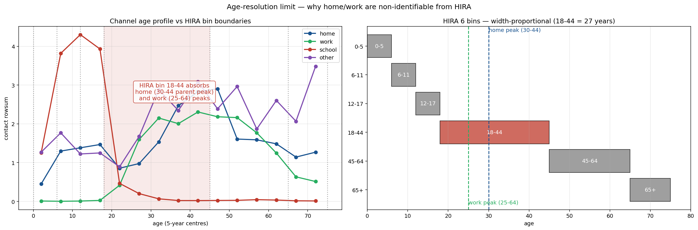
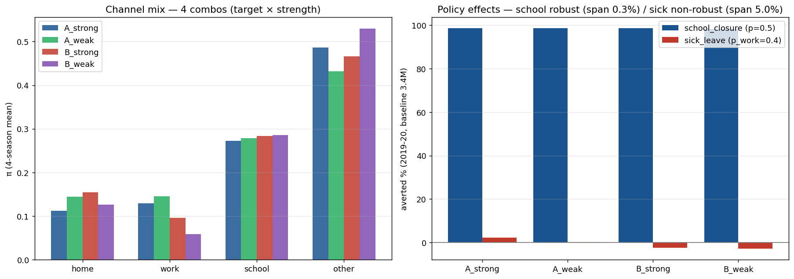
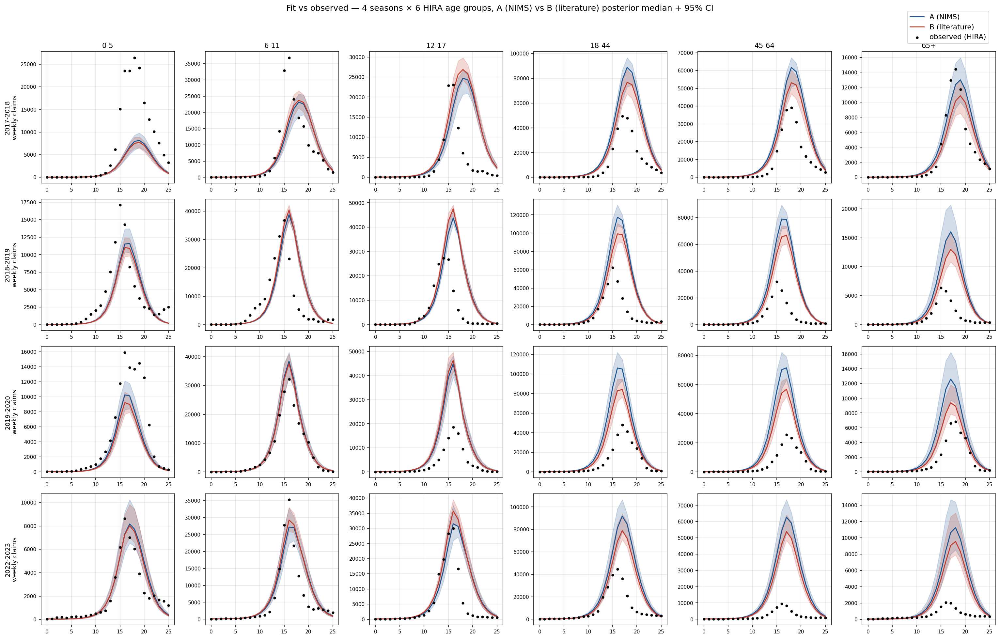
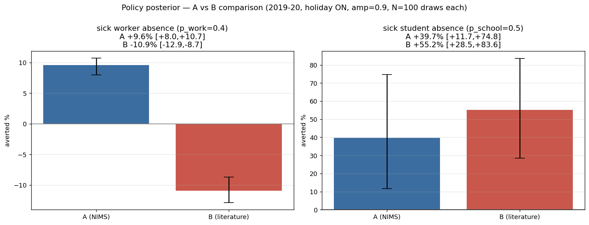
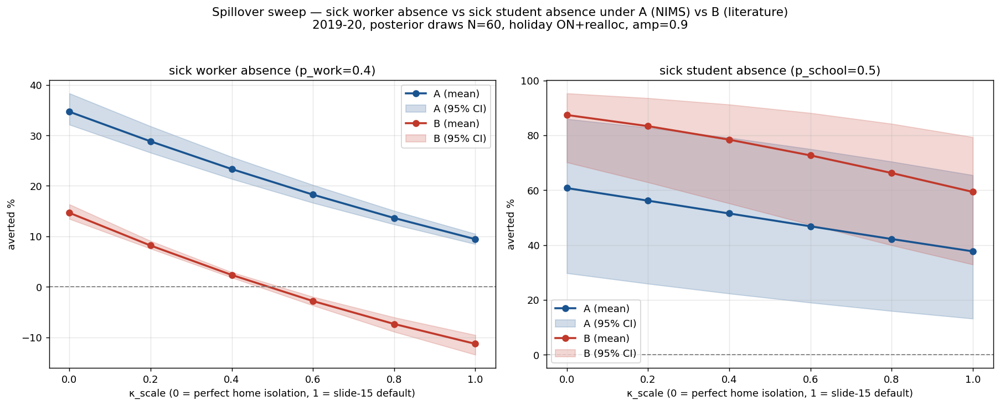
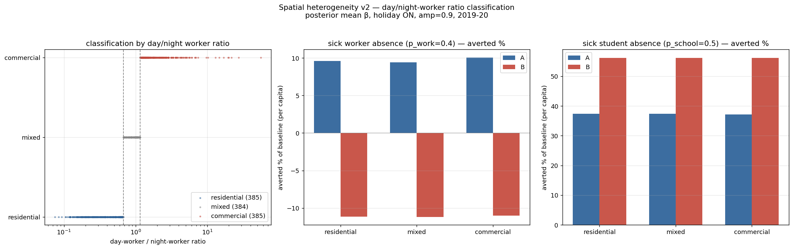

<!-- _class: lead -->
<!-- _paginate: false -->

# 수도권 인플루엔자 모델 Calibration
## 모수 식별성 — 진단·해결·결과

조현우
데이터: 국민건강보험공단 J09–J11 진료에피소드 (2018–2024)

**2026년 6월**

---

# 1. 연구 맥락

**정책 목표**: 정상 시기 인플루엔자 sick-leave / 학교 결석 정책의 ICER

**모델**:
- SVEIR (S → V → E → I → R) + 4-channel FOI (가정 / 직장 / 학교 / 기타)
- 연령 NIMS 15군 (5세 단위)
- 수도권 (서울 + 인천 + 경기), 4 정상 시즌

**데이터**: HIRA J09–J11 진료에피소드, 6 연령군

HIRA 의 장점:
- **카운트 단위** (인구 분모 깨끗)
- γ_report 탐지율

---

# 2. γ_report — 탐지율의 의미

**정의**: 실제 감염자 중 HIRA 진료 청구로 잡힌 비율

$\gamma_{\text{report}}$ = (청구 카운트) / (실제 감염자)

- 보이는 부분 = HIRA 청구 (분자, 측정 가능)
- 숨은 부분 = 무증상 + 자가관리 + 미진료 (분모, 측정 불가)

**$\gamma$ = 기준 탐지율 × 연령 상대비**:
- **기준 탐지율**: Jung et al. (2025) q = 0.67 (감염 → 증상) 에서 무증상·미청구 제외 → **0.6**
- **연령 상대비**: 데이터가 식별 가능한 차원 (sweep 에서 CDC 비율 NLL 최저 확인)

| 연령군 | CDC 상대비 | γ (기준 탐지율 0.6 적용) |
|---|---|---|
| 어린이 | **1.45** | 0.87 |
| 성인 | **0.65** | 0.39 |
| 노인 | **0.90** | 0.54 |

---

# 3. 식별성 문제 — 곱셈의 함정

**모델 관측 신호**:

$$
\text{청구 카운트} \;\propto\; \beta \times \phi \times \gamma \times s(t)
$$

**두 시나리오, 같은 청구**:

| | 시나리오 A | 시나리오 B |
|---|---|---|
| 실제 감염 (β·φ) | 100 | 250 |
| 탐지율 (γ) | 0.25 | 0.10 |
| **HIRA 청구** | **25** | **25** |

데이터만 보면 A 와 B 구분 불가 — **구조적 비식별**

데이터를 더 모아도 **곱** 만 결정될 뿐 개별 분해 불가.
모델 구조 자체의 성질.

---

# 4. 진단 — Multi-start 가 보여준 다봉성

**검증**: 8개 시작점 multi-start (warm / bio_informed / 극단 / 무작위 등)

| 지표 | 값 | 의미 |
|---|---|---|
| NLL spread | **0.57%** | 8개 fit 거의 동일 적합 |
| φ 평균 CV | **53%** | 같은 NLL 위에 여러 mode |
| γ_elder CV | **63%** | 분해 자유도 큼 |
| β 평균 CV | **65%** | channel split swap |

---

같은 데이터 fit, 다른 (β, φ, γ) — **곱은 식별, 분해는 안 됨**

---

# 5. R(0) 연령 구조 누락

**2019-2020 시즌 fit**:

| Test | 결과 | 의미 |
|---|---|---|
| 65+ peak ratio (pred/obs) | **1.43** | 노인 구조적 과대 |
| 65+ raw attack rate | 7.5% (정상) | 감염 수준 자체는 적절 |
| 다른 5 연령 fit | 0.63 – 1.11 | 65+ 만 outlier |

**원인 추적**:
1. R(0) (초기 면역) = **균일 30%** (전 연령 동일)
2. 그러나 노인 실제 면역 (이전 시즌 누적) >> 30%
3. → 노인 S 모집단 **과대**, I 과대생성
4. → 데이터 fit 위해 γ_elder 가 흡수 (0.25 → 0.05 corner)

**모델 내부 단순화 문제** — 외부 데이터가 흡수 → 수정 가능

---

# 6. 해결 ① — R(0) 계단 형식

**변경**: 균일 30% → 연령 계단

| 연령군 | R(0) 기존 | R(0) **계단** | 근거 |
|---|---|---|---|
| 0–19 | 0.30 | **0.10** | 최근 시즌 노출 적음 |
| 20–49 | 0.30 | **0.30** | 기준 |
| 50–64 | 0.30 | **0.45** | 누적 노출 + 백신 |
| 65+ | 0.30 | **0.65** | 백신 정책 + 누적 면역 |

**근거**: POLYMOD 이전 시즌 누적 + Vandegrift 2010 미국 추정

**효과**:
- 65+ peak ratio **1.43 → 0.99** 
- γ_elder CDC band 안: 2/8 → 7/8 시작점
- γ_elder CV: 63% → 25%

---

# 7. 해결 ② — 추정 대상 분리

곱 **β · φ · γ** 중 어느 차원을 데이터로 결정할 수 있나?

| 파라미터 | 의미 | 데이터 정보량 | 결정 방법 |
|---|---|---|---|
| **γ_report** | 탐지율 | **없음** (분모 미관측) | **외부 고정** (CDC + PSA) |
| **φ_age** | 연령별 감수성 | **약함** | **prior 좁게** (Cauchemez ±15%) |
| **β_channel** | 채널별 전파율 | **강함** (peak 시점·높이) | **데이터로 추정** (NUTS) |

**Reparam**: β·φ 곱셈 ridge → primary axis 를 **log R0** 로 회전
- log R0 (시즌별 4) + 채널 비율 (시즌별 4) + φ (14)
- β 는 (R0, 채널 비율, φ) 에서 NGM 역산으로 **derive**

---

# 8. 관측모델 — Poisson → Negative Binomial

**문제**: Poisson 가정 (분산 = 평균) 으로 청구 데이터 변동 못 잡음
- 주별 변동·보고 지연·요일 효과 → 실측 **분산 > 평균** (과분산)
- Poisson posterior 띠 좁음, coverage **12%**

**해법**: 관측을 **Negative Binomial-2** 로
$$\text{obs} \sim \text{NegBin}\!\left(\mu = \text{pred},\; \text{Var} = \mu + \mu^2/k\right)$$

| 지표 | Poisson | **NB** |
|---|---|---|
| 95% coverage | 12% | **95.2%** (연령별 89-99%) |
| r_hat max | 2.38 | **1.02** |
| ess_min | 5 | **581** |
| wall time | 6h 25min | **41분** |

NB 가 **coverage 와 수렴 동시 해결** — 분포적으로 데이터 재현 

---

# 9. φ 비식별 실증

**같은 sample 의 φ posterior**:

| chain | φ[0] (0–4세) | 해석 |
|---|---|---|
| 0 (warm) | 4.90 | |
| 1 (bio_prior) | 5.73 | chain 마다 |
| 2 (distributed) | 6.37 | 서로 다른 mode |
| 3 (home_dominant) | 6.62 | (ridge 위 다른 점) |

| 진단 | 값 | 의미 |
|---|---|---|
| φ posterior mean | 3.17 | prior median 1.0 무시 |
| φ near tail (>2.0) | **67%** | prior 와 무관 |
| r_hat (φ) | **4.46** | chain 분산 |
| ess (φ) | **5** | 거의 안 섞임 |

**"φ는 데이터 정보 약함" 진단을 데이터로 확정**
→ φ 외부 고정 시도 필요 (prior 좁힘 or 점추정)

---

# 10. 선행연구 대비 — Jung et al. (2025)

같은 데이터·모델 출발점, **다른 식별성 처리**

| 측면 | Jung et al. 2025 | 본 연구 |
|---|---|---|
| 데이터 | HIRA 인플루엔자 청구 | 동일 |
| 모델 | 연령별 SEIR | 동일 |
| 백신 | 한국 청소년·노인 정책 | 동일 |
| **식별성** | reporting q = 0.67 **단일값 우회** | 진단·분해·고정 + PSA |
| 정책 시뮬 | 백신 coverage 시나리오 | sick-leave 정책 (수도권 metapop) |
| 불확실성 정량 | 부분 | β·R0 posterior + γ·φ PSA |

**방법론적 기여**: identifiability 정면 진단·해결 + 출처 객체화 (γ_registry)

---

# 11. 채널 식별성 한계 — 4 시즌·방학 모두 실패

**데이터로 식별 가능**  : R0, school 채널, other 채널, 계절성

**데이터로 식별 불가** : **home, work 채널**

| 시도 | 결과 |
|---|---|
| 단일 시즌 4-channel free | home, work ≈ 0 |
| Winter break 모델 (school_only) | home, work ≈ 0 |
| Winter break + 접촉 재배분 (κ 재사용) | home, work ≤ 0.01 |
| amp × realloc sweep (9 조합) | home ≤ 0.004 |
| **4 시즌 합동 + 방학 + amp** | **home ≤ 0.011, work ≤ 0.011** |

**원인** (구조적): HIRA 6 연령군 집계에서 30-44 (home/work) 신호가 18-44 넓은 연령구조에 묻힘. ILI 동일 — high resolution 데이터 없음.

→ home, work 는 **field knowledge prior 로 채움** (φ, γ 와 같은 논리)

---

# 12. 겨울방학 — 누락된 메커니즘 발견

**문제**: 한국 겨울방학 (12월말 ~ 2월) 모델에 없었음 — 인플루엔자 peak 시기와 겹침

**가설**: 방학 누락이 여러 "비식별" 을 만든 **misspecification**

**도입**:
- school contact 시간 의존 (학기 1.0 → 방학 0.3, 부드러운 ramp)
- 접촉 보존: 감소분이 home spillover 로 (기존 κ 재사용, 새 파라미터 0)

**결과** — NLL **+400,000 개선** (multi-start 잡음 80K 의 **5배**):

| 변화 | 방학 OFF (이전) | 방학 ON (도입 후) |
|---|---|---|
| school π | 0.61 (과대) | **0.24** |
| 데이터 선호 amp | 0.3 (낮음) | **0.9** (방학이 "급락" 직접 설명) |
| home / work π 회복 | 0.27 (살림) | **misspec 보정 효과였음** |

— misspecification (빠진 메커니즘) 이 "가짜 비식별" 을 만든다

---

# 13. — 이전 결론 재평가

| 이전 결론 | 재평가 (방학 ON 진단 후) |
|---|---|
| **γ level=0.6 으로 home 살림 (0.27)** | **방학 누락 보정 효과**였음 — γ CDC 로 충분 |
| **work : other = 0.349 NIMS 고정** | 그 시점 일부 정합화 — 지금은 **4 조합 prior 일반화** |
| **channel mix 4 채널 정상화** | 방학 누락 환경의 채널 분리 산물 |

**방학 반영 후에도 robust 한 값들**:
-  **winter break** (NLL +400K) — 새 메커니즘
-  **amp 식별** (0.9 선호) — 강한 계절성 + 방학 동시
-  **R0 식별** (시즌별 ~2.0)
-  **home/work 구조적 한계 확정** — 4-시즌·방학·재배분 다 실패

진단·해소를 반복하며 자기수정 — misspec 이 "가짜 비식별" 처럼 보이게 함

---

# 14. 왜 채널을 가정으로? — 연령 해상도 한계

---
# 14. 왜 채널을 가정으로? — 연령 해상도 한계

**원인**: HIRA · ILI 데이터의 연령군 구조 (6 군)

| HIRA bin | 폭 | 묻히는 채널 신호 |
|---|---|---|
| 0–5, 6–11, 12–17 | 6년씩 | school (0–19) 분리 OK |
| **18–44** | **27 년** | **home peak (30–44) + work peak (25–44) 모두 흡수**  |
| 45–64 | 20년 | work peak (45–64) 흡수 |
| 65+ | 10년+ | other / 노인 |

→ 18-44 bin 이 home / work peak 둘 다 포함 → 둘이 같은 bin 안에서 trade-off 만 보이고 분해 불가

**검증**: 단일 시즌·4 시즌·방학·재배분 — **모두 home/work 식별 실패** (NLL 무차이)
**한계**: ILI · HIRA 해상도 동일, 더 고운 한국 인플루엔자 데이터 없음

→ **데이터로 분해 불가** (구조적) → **field knowledge 로 채움** (다음 슬라이드)

---

# 15. 채널 prior — A / B 입력 (대칭)

두 외부 근거 — **둘 다 ÷ unit_R0 로 π 공간 변환** (대칭):

| 구분 | home | work | school | other | 출처 / 의미 |
|---|---|---|---|---|---|
| **A 입력** (NIMS contact share) | 0.27 | 0.20 | 0.17 | 0.37 | 접촉빈도 (감염효율 미반영) |
| **B 입력** (Italy 2009 R0 기여) | 0.40 | 0.10 | 0.27 | 0.23 | H1N1 fit (감염효율 포함) |
| **공통 변환** | — | — | — | — | **÷ unit_R0 = (8.70, 6.21, 25.40, 9.33) 후 normalize → β share π** |
| **target_A π** | 0.29 | 0.29 | 0.06 | 0.36 | prior center A |
| **target_B π** | 0.47 | 0.17 | 0.11 | 0.25 | prior center B |

unit_R0: φ=1, sf=1.7 에서 채널별 단위 R0 기여 (school 큰 값 → β share 작음).

**prior 강도** (centered logit 에 Gaussian penalty):
- σ_weak = (home 0.1, work 0.1, school 1.0, other 1.0) — home/work tight, school/other 데이터 추정
- σ_strong = (0.1, 0.1, 0.1, 0.1) — 전 채널 tight

A·B 차이는 입력의 **의미** (접촉 vs R0 기여) — 변환은 동일

---

# 16. 4 조합 점추정 — 채널 mix robust

**탐색 실험** (L-BFGS 점추정 × 4 조합, 분 단위):

| combo | home | work | school | other | R0 | total obj |
|---|---|---|---|---|---|---|
| A_strong | 0.11 | 0.13 | 0.27 | 0.49 | 1.98 | −28.31M |
| A_weak | 0.14 | 0.15 | 0.28 | 0.43 | 1.98 | −28.35M |
| B_strong | 0.15 | 0.10 | 0.28 | 0.47 | 1.98 | −28.32M |
| B_weak | 0.13 | 0.06 | 0.29 | 0.53 | 1.99 | −28.36M |

**판독**:
- school/other 는 가정 무관 비슷한 수렴 (0.27-0.29 / 0.43-0.53) — **데이터가 움직임** (σ=1.0)
- home/work 는 prior 가정 차이 그대로 (σ=0.1 tight) — **데이터가 못 봄**
- prior 추가 NLL 손실 **~85K** (multi-start 잡음 수준) — 데이터 강하게 거부 안 함

채널 mix 자체는 **prior 가정대로 흐름** — 데이터가 분해 불가 재확인

---

# 17. 4 조합 점추정 — 정책 효과 robust성

| 정책 | averted 범위 (4 combos) | 판정 |
|---|---|---|
| **감염 학생 결석** (p_school=0.5) | **98.3% ~ 98.6%** (span 0.3%) |  **강건** (어떤 가정이든) |
| **병가** (p_work=0.4) | **−2.8% ~ +2.2%** (span 5.0%) |  효과 작음 (robust) / **부호 가정 의존** |

**학교 정책 → 강한 결론**  /  **병가 정책 → 한국 직장전파 외부 데이터 필요**

A 근거 (NIMS, work π 높음) → 병가 양수 / B 근거 (문헌, work π 낮음) → 병가 음수 (home spillover 우세)

---

# 18. 정책 메커니즘 — 감염자 결석·결근

두 정책 모두 **"증상 있는 감염자가 집에 머문다"** 메커니즘 (대칭):

| 정책 | 의미 | FOI 적용 |
|---|---|---|
| **감염 학생 결석** | 감염 학생만 등교 안 함 | `I_eff_school = p_school × I_student` |
| **병가** (감염 근로자 결근) | 감염 근로자만 출근 안 함 | `I_eff_work = p_work × I_worker` |

**물리적 "학교 폐쇄" 아님**:
- C_school (접촉 구조) **그대로** — 건강 학생 정상 등교
- θ 가 **감염자 (I) 에만** 적용 — FOI 에서 감염자 기여만 차단
- spillover: 결석/결근 감염자 → 가족 노출 (κ × (1−θ))

**약한 개입 (감염자만 결석) 으로도 큰 효과** (38–87%) — 더 인상적

---

# 19. A·B Production — Fit vs 관측 (비식별 시각 확인)

**구성**: 4 시즌 × 6 HIRA 연령군. 검정 점 = 관측 HIRA 청구, **파랑 = A (NIMS)**, **빨강 = B (literature)** posterior 중앙값 + 95% CI (full NUTS, 9h 동시 실행)

---
# 19. A·B Production — Fit vs 관측 (비식별 시각 확인)

**판독**:
- **A 와 B 곡선 거의 겹침** — 모든 연령·시즌에서 데이터 적합 동일
- **채널 가정 (NIMS 접촉 vs 문헌) 이 달라도 fit 거의 비슷** = 채널 비율 거의 비식별
- peak 시점·형태 양 가정 모두 재현

---

# 20. A·B Production — 정책 효과 posterior (NUTS)

NB + 겨울방학 + amp=0.9 + γ CDC + 4 시즌, 채널 prior weak 각각 A·B

---

# 20. A·B Production — 정책 효과 posterior (NUTS)

| 정책 | A (NIMS) | B (literature) | CI overlap |
|---|---|---|---|
| **감염 학생 결석** | **+39.7%** [11.7, 74.8] | **+55.2%** [28.5, 83.6] | **78.3%** (강건) |
| **병가** (감염 근로자 결근) | **+9.6%** [+8.0, +10.7] | **−10.9%** [−12.9, −8.7] | **0%** |

| 지표 | A | B |
|---|---|---|
| 수렴 r_hat | 1.108 | 1.098 |
| ess_min | 31 | 42 |
| divergence | 0 | 0 |
| R0 mean | 1.92 | 1.93 (동일 — 채널 무관) |

---

# 21. 모델 한계 — Peak over-prediction

posterior mean 이 peak 과대 — NB 과분산 (phi_nb=1.3) trade-off:

| 연령군 | peak ratio (pred/obs) | 진단 |
|---|---|---|
| 0–5 | **0.6×** (과소) | NB 분산이 underfit 허용 |
| 6–11 | 1.0× | OK |
| 12–17 | **2.4×** | 과대 |
| 18–44 | **2.2×** | 과대 |
| 45–64 | **2.8×** | 과대 |
| 65+ | **1.8×** | 과대 |

**원인**: NB phi_nb=1.3 → 분산 ≫ 평균 → 10% 오차의 ΔNLL 가 규모와 무관하게 평탄 → NLL 최소화는 통합 ΣNLL 위주 → peak 잔차 페널티 약함 (95% band 안 → coverage 유효)

**정책 함의**: averted **%** 비율 상쇄 (영향 작음) / 절대 **카운트** 1.5-3× 과대

---

# 22. Spillover κ sweep — 가구 격리 수준에 따른 효과

---
# 22. Spillover κ sweep — 가구 격리 수준에 따른 효과

**κ_scale**: 0 = 완전 가구 격리 (가족 노출 0) / 1.0 = 슬라이드 default

| κ_scale | 감염 학생 결석 (A / B) | 병가 (A / B) |
|---|---|---|
| 0.0 (완전격리) | +61% / +87% | +35% / +15% |
| **0.4** | +52% / +78% | **+23% / +2%** (둘 다 양수) |
| 0.6 | +47% / +73% | +18% / **−3%** |
| 1.0 (현재) | +38% / +59% | +9% / **−11%** |

**부호 전환점**:
- 감염 학생 결석: **A·B 둘 다 전 구간 양수**  robust
- 병가: A 전 구간 양수 / B 는 **κ ≈ 0.49 에서 부호 반전**

**가구 노출 60%+ 감소 (κ≤0.4) → A·B 둘 다 양수** — "병가 + 가구 격리 가이드" 결합 robust

---

# 23. 공간 이질성 — 지역 분류 (주간 / 야간 인구비)

KT mobility (시간대별) 로 행정동 분류:

$$
\text{ratio}_j = \frac{\text{주간 인구}_j \;(9{-}17\text{시 노동자 위치})}{\text{야간 인구}_j \;(\text{거주})}
$$

| 분류 | 식별된 지역 (range 0.07 – 21.8) |
|---|---|
| **상업** (ratio > 1.20, 385개) | 종로 명동 21.8, 종로1·2·3·4가 19.9, 중구 19.5 |
| **혼합** (0.41 – 1.20, 384개) | — |
| **주거** (ratio < 0.41, 385개) | 서대문 0.07, 관악 0.08 |

---

# 24. 공간 이질성 결과

**per-capita averted % of baseline** (행정동별, 거주지 기준):

| label | region | sick worker absence | sick student absence |
|---|---|---|---|
| A | commercial | +10.07% | +37.19% |
| A | residential | +9.59% | +37.41% |
| B | commercial | −11.02% | +56.12% |
| B | residential | −11.13% | +56.20% |

**commercial / residential ratio**: A: 1.05 / 0.99,  B: 0.99 / 1.00
**commercial − residential**: 0.1 – 0.5pp (정책 의미 없음)

→ 통근 사회: 직장 노출 차단 혜택이 **거주지(전역) 로 분산** → 거주지 기준 효과 균질

---

# 25. 공간 분석 결론 — null

**공간 모델 (metapop + KT mobility) 결과**:

- 상업 / 주거 정확히 식별 (주간 / 야간 21.8× 차이)
- 그럼에도 정책 효과는 지역 유형에 무관** (<0.5pp)
- 약한 robust 방향성 (sick worker absence 상업>주거, A·B 일치) — 크기 미미

**정책 함의**:

| | |
|---|---|
| 균일 정책 시행 | 지역 차등 실익 없음 |
| 공간 타겟팅 | 정책적 의미 < 1% (실행 비용 대비 무가치) |

**"공간 모델로 공간 무관성을 입증"**

---

# 26. 정리

**Calibration** (식별성 + 방학 포함 여부):
-  R0·school·other·계절성·**winter break** 식별
- home·work·γ·φ 구조적 비식별 → **field knowledge prior 4 조합 robust**
- 의미: misspec(방학 누락) → 가짜 비식별처럼 보임 (γ 기준 탐지율 / work:other 재확인)

**정책 효과 (감염자 결석·결근)**:
- 감염 학생 결석: **robust 양수** (4 combos 98%, posterior 38-87%)
- 병가: 가정격리(κ≤0.4) 동반 → robust 양수, 단독 → **B 음수 (가정 의존)**
- 공간: **null** (KT mobility backpropagation, 균일 정책 정당)

**한계** (peak 과대):
- 절대 카운트 1.5-3× 과대 (NB phi_nb=1.3 trade-off) → 백분율 결론만 사용

---

<!-- _class: lead -->
<!-- _paginate: false -->

# 27. 요약

- **비식별 · misspec 반복 진단** → 데이터가 보는 것 추정 / 못 보는 것 외부 근거
- **모델 개선**: R(0) 계단 + **winter break** (NLL +400K)
- **데이터 식별**: R0, school, other, 계절성 (amp ~ 0.9), 방학 효과
- **데이터 한계** (HIRA 구조): home, work — **field knowledge prior 4 조합 robust**
- **흐름**: 4 조합 점추정(탐색) → A·B production(본추정 fit + posterior)
- **정책 결론**:
  · 감염 학생 결석: **38-87% robust** (모든 가정 일관)
  · 병가: **가정격리 (κ≤0.4) 동반 시 robust**, 단독 시 가정 의존
  · 공간: **null** (KT mobility backpropagation, 균일 시행 정당)
- **한계**: NB peak 과대 1.5-3× → % 결론만 사용
- **추가**: ICER, 한국 직장전파 비중, 연령구조 추가 (공간)
