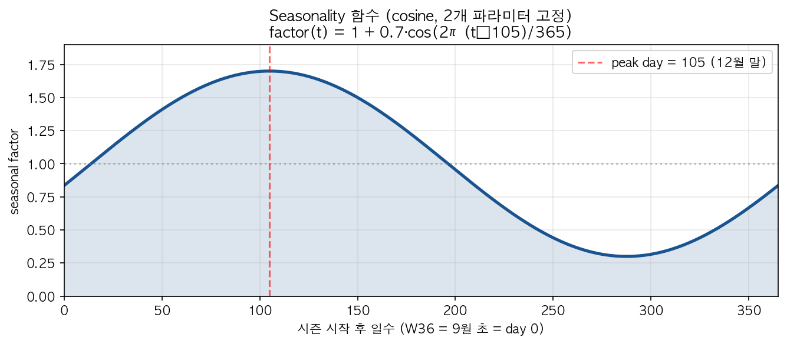
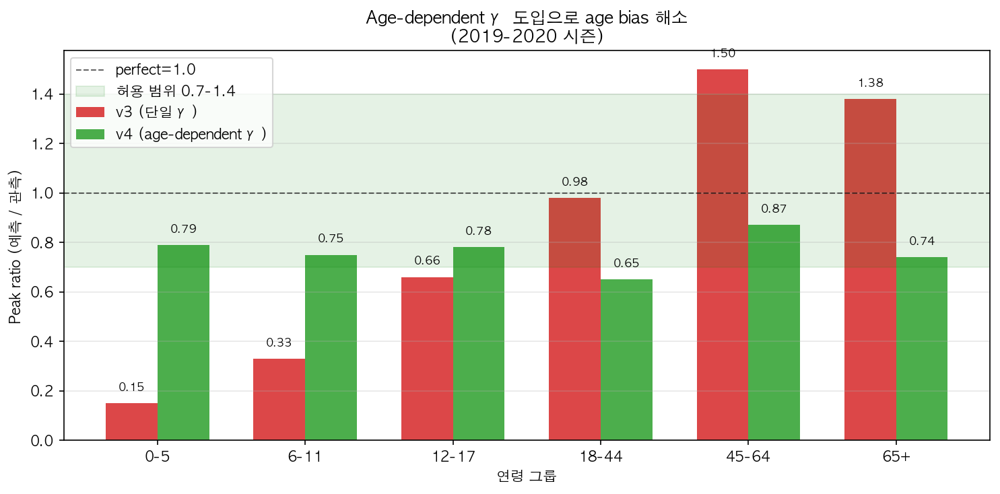
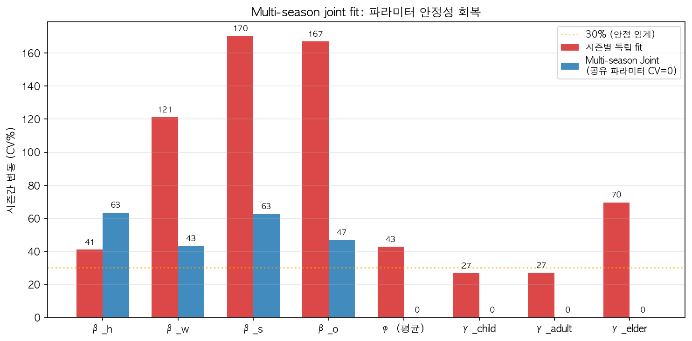
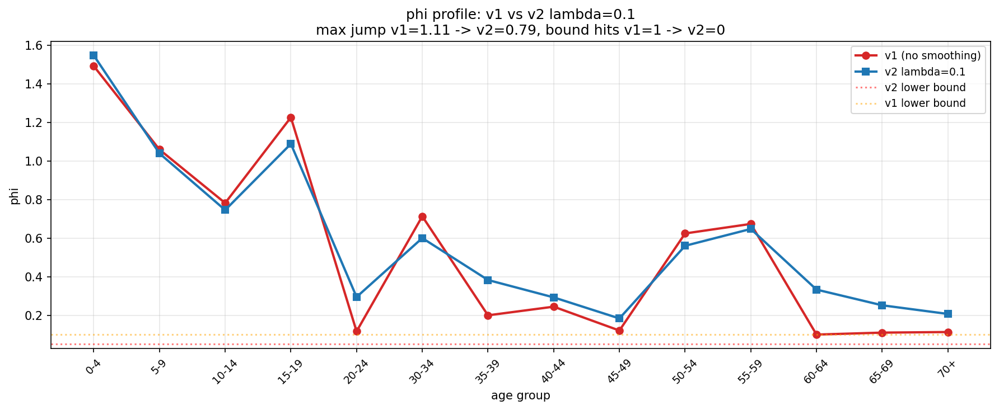
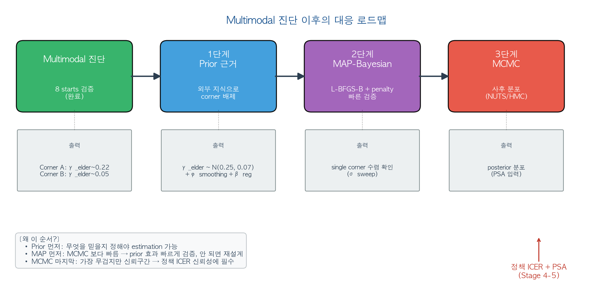
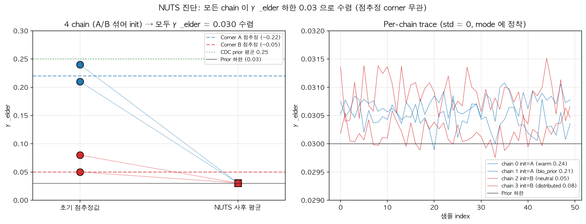
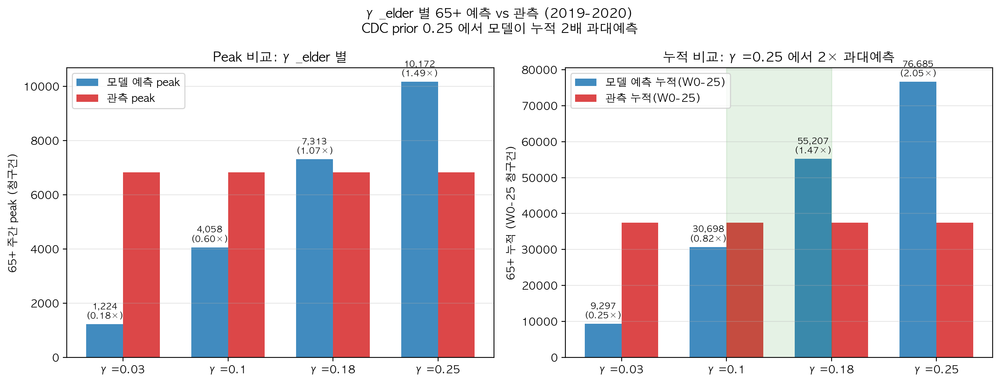
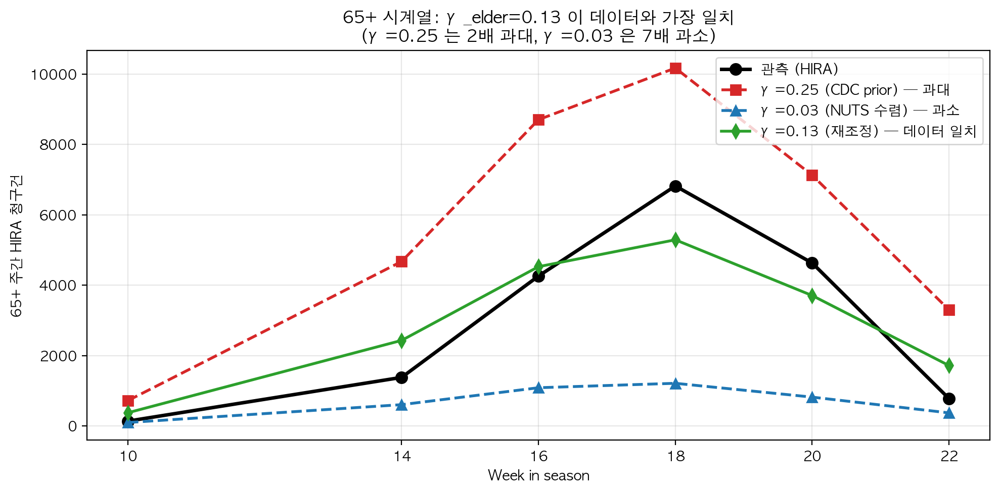

<!-- _class: lead -->
<!-- _paginate: false -->

# 수도권 인플루엔자 모델
## Calibration 진행
### — Identifiability 진단 중심

조현우
데이터: 국민건강보험공단 J09–J11 진료에피소드 (2018–2024)

**2026년 6월**

---

# 1. 연구 배경

**정책 목표**: 정상 시기 인플루엔자 sick-leave 정책의 ICER 분석

**모델 구조**: 수도권 SVEIR + 4-channel FOI + age-stratified
- Compartment: S → V → E → I → R (SEIRV, 5개)
- FOI 채널: 가정 / 직장 / 학교 / 기타
- 연령: NIMS 15군 (5세 단위)

**현재 단계**: **Calibration**


> 현재 문제점: **Calibration 과정에서 발견한 identifiability 문제에 대책 마련중**

---

# 2. 데이터 개요

**HIRA 진료에피소드**
- J09–J11 코드, episode 단위
- **카운트** 단위 (인구 분모 깨끗 — ILI 대비 장점)
- 수도권 (서울 + 인천 + 경기), 6 연령군

**정상 시즌 13개 식별**
- COVID 기간 제외 (2020–2022)
- 시즌: W36 ~ W35 (9월 초 시작)


<div class="small">

ILI 대비 장점:
- 단위 명확: count → γ_report 의미 = "감염자 중 진료 청구 비율"
- ILI 의 분모(외래환자)는 γ 와 혼합되어 해석 모호

</div>

---

# 3. 모델 파라미터 구조

**Fit 대상 (33개)**
- **β** 4채널 × 4시즌 = 16개 (전파율)
- **φ** 14개 (연령별 susceptibility, 14군 — 25-29 reference)
- **γ_report** 3개 (child / adult / elder)

**고정**
- σ, γ, κ (질병 자연사)
- seasonality (cosine, amp=0.7, peak=105)
- 백신 (VE=0.5, 연령별 coverage)

> **핵심 구조**: 감염 신호 ∝ **β × φ × γ × seasonal(t)**
> — 모든 파라미터가 곱셈으로 결합


---

# 4. Calibration 시행착오 요약

| 단계 | 발견한 문제 | 처치 | 결과 |
|---|---|---|---|
| v1 | β corner (R0<1, outbreak 없음) | β 초기값 상향 | outbreak 발생 |
| v1 | min_rate 과대 (79% 바닥) | 1.0 → 0.01 | floor 박힘 해소 |
| v2 | β × seasonality 곱셈 결합 | cosine 고정 | seasonality 자유도 제거 |
| v3 | age bias (어린이 undershoot 0.15) | age-dependent γ | bias 개선 |
| v4 | 시즌간 모든 CV > 30% | multi-season joint estimation| β 일관성 개선 |
| v5 | φ 인접 점프 (1.11) | phi smoothing λ | 28% 감소 |
| **현재** | **Multimodal identifiability** | **Multi-start 검증 중** | **(B) 다중 corner 확인** |


---

# 5. v2: Seasonality 단순화 — Identifiability 1차 사례

**문제**: β × amp 가 곱셈 결합 → 분리 불가
- (β=0.5, amp=1.5) ≈ (β=0.05, amp=15) → 같은 NLL

**처치**: Gaussian 4-param fit → **cosine 2-param 고정**



**결과**: seasonality corner 제거, 19-dim → 21-dim 단순화

---

# 6. v3: Age-dependent γ — Age Bias 해결

**문제**: 단일 γ 로 fit → 어린이 massive undershoot, 노인 overshoot

**근거** :
- CDC 2015 (Reed et al.)
- 어린이: 부모가 데려옴 → 의료 접근성 ↑
- 성인: 자가관리 비율 ↑ (진료 X)
- 노인: 만성질환 동반진단, 백신 coverage 효과 분리 필요

---

**Default**: γ_child=0.40, γ_adult=0.18, γ_elder=0.25



---

# 7. v4: Multi-season Joint Fit

**문제**: 시즌별 독립 fit → **모든 파라미터 CV > 30%**

**처치**: 4 시즌 동시 fit
- φ, γ 는 **시즌간 공유** (생물학·행태 → 시즌 무관 가정)
- β 4채널 × 4시즌 = **시즌별 변동 허용** (병원체 차이)
- 33-dim vector, L-BFGS-B



---

# 8. v5: φ Smoothing — 부분 개선

**문제**: φ 인접 연령 비현실적 점프
- 예: φ(20-24) = 0.30 vs φ(30-34) = 0.60 vs φ(35-39) = 0.38

**처치**: smoothing penalty $\lambda \sum_i (\phi_{i+1} - \phi_i)^2$, λ=0.1



**결과**: 점프 1.11 → 0.79 (**28% 감소**), data NLL 손실 0%
But, oscillation 잔존 — λ 바꿔가며 실험 필요

---

# 9. Multimodal Identifiability

**ILI 프로젝트 결과에서**:
- 같은 시즌, 같은 NLL, **β_h: 1.016 vs 0.013** (78배 차이)
- seasonality_sigma 하한 도달 + peak_day 상한 도달 = corner

**HIRA 도 같은 위험?** → **Multi-start 검증** (8개 시작점 병렬)

| 시작점 | 의도 |
|---|---|
| warm | 현재 v2 결과 |
| neutral | φ=1.0, β=0.06 |
| **low_phi** / **high_phi** | φ=0.5 / 2.0 (극단) |
| **bio_prior** | 어린이 φ =2 / 노인 φ = 0.5 |
| **home_dominant** | β_h 크게 (ILI corner 모사) |
| distributed / random | 균등 / 무작위 |

**8개 모두 완료, success=True. Wall time 17.5h (병렬)**

---

# 10. Multimodal 시그니처 (최종, 8/8)

**NLL spread**: <span class="blue">0.57%</span> (8개 거의 동일)
**파라미터 CV**: <span class="red">phi 53%, γ_elder 63%, beta 65%</span>

| 지표 | 값 | unique 임계 | 판정 |
|---|---|---|---|
| NLL spread | **0.57%** | < 0.5% | borderline |
| phi 평균 CV | **53.1%** | < 10% | ✗ 불통과 |
| γ_elder CV | **63%** | < 15% | ✗ 불통과 |
| β 평균 CV | **65.3%** | < 20% | ✗ 불통과 |
| β 최대 CV (2017-18 work) | **122%** | — | channel swap |

<div class="red center" style="margin-top: 16px">

극단 시작점 (low_phi=0.5, high_phi=2.0, random) 포함 8개 모두
거의 같은 NLL 영역

</div>

---

# 11. 8개 시작점 결과

| start | NLL final | γ_elder | φ(20+) | corner |
|---|---|---|---|---|
| random | −28,595,697 | 0.074 | 0.840 | **B** |
| high_phi | −28,595,472 | 0.077 | 0.432 | **B** |
| low_phi | −28,549,298 | 0.089 | 0.428 | **B** |
| distributed | −28,544,887 | 0.078 | 1.530 | **B** |
| **bio_prior** | −28,543,498 | **0.210** | 0.604 | **A** |
| **warm** | −28,540,849 | **0.240** | 0.383 | **A** |
| home_dominant | −28,462,961 | 0.051 | 1.060 | **B** |
| neutral | −28,433,365 | 0.054 | 1.038 | **B** |

<div class="small center">

NLL 차이 162K (전체 28.5M의 0.57%) — 노이즈 수준
하지만 γ_elder 는 0.05 ~ 0.24 로 **4-5배 차이**, φ(20+) 도 0.38 ~ 1.53 으로 4배 차이

</div>


---

# 12. 왜 잘 안되는지 원인 분석

1. **자유도 vs 데이터**
   - 파라미터 33개 vs 데이터 156점 (4시즌 × 26주 × 6연령 / overlap)
   - 본질적으로 under-determined

2. **곱셈 결합** (β × phi × γ × sf)
   - 원리적 비식별 — hyper parameter fixing으로 부분 해결, 다 풀 수 없음

3. **채널 간 정보 중첩**
   - β_home vs β_other: 같은 사람-사람 접촉, contact matrix 만 다름

4. **비선형 ODE**
   - non-convex loss, 여러 local minima


---

# 13. 대응 전략 — 3단계 로드맵




---

# 14. <span class="blue">[1단계]</span> Prior 근거 — Corner 배제 논리

**핵심 질문**: "두 corner 중 어느 쪽이 현실적인가?"

| | Corner A (warm, bio_prior) | Corner B (6/8) |
|---|---|---|
| γ_elder | **0.22** (CDC 정합) | **0.05** (bound 근접) |
| 해석 | 노인 진료율 ~22% | "노인 환자의 95% 가 의료기관 안 감" |

**Corner B 가 비현실적인 3가지 이유**

1. **한국 데이터** (Park JKMS 2023): 노인 입원율 35–50% → γ_elder=0.05 와 모순
2. **국제 비교** (CDC, MHLW, EU surveillance): γ_elder < γ_adult 인 보고 사례 없음


<div class="red center" style="margin-top: 8px">


</div>

---

# 15. <span class="blue">[1단계]</span> Prior 설계 표

| 파라미터 | Prior | 평균 근거 | 역할 |
|---|---|---|---|
| **γ_child** | Normal(0.40, 0.10) | CDC <18 multiplier |  |
| **γ_adult** | Normal(0.18, 0.05) | CDC 18-64 multiplier | 안정성 유지 |
| **γ_elder** | **Normal(0.25, 0.07)** | **CDC 65+, 한국 노인 의료** | **Corner B 차단** |
| **φ_a** | smoothing λ·Σ(Δφ)² | 연령별 연속성 | 인접 점프 억제 |
| **β** | weak HalfNormal | NIMS contact magnitude | channel swap 완화 |

**우선순위**: γ-elder informative > φ smoothing > β weak (multimodal 주축 순서)


---

# 16. <span class="blue">[2단계]</span> MAP-Bayesian (예정)

**MAP** = posterior 분포의 최고점 (점추정 + prior)

**목적함수**:
$$
\text{MAP loss} = \underbrace{\text{NLL}_\text{data}}_{\text{데이터}} + \underbrace{\sum_g \frac{(\gamma_g - \mu_g)^2}{2\sigma_g^2}}_{\gamma \text{ prior}} + \underbrace{\lambda_\phi \sum_i (\phi_{i+1} - \phi_i)^2}_{\phi \text{ smoothing}} + \underbrace{\sum \beta^2 / 2\sigma_\beta^2}_{\beta \text{ reg}}
$$

**장점**: 현재 L-BFGS-B 인프라 그대로 (penalty 항만 추가) — **빠른 검증**

**검증 방법**: σ_γ_elder sweep (∞ → 0.10 → 0.07 → 0.05 → 0.03) × multi-start 반복
→ "모든 시작점이 Corner A 로 수렴" 되는 최소 prior 강도 결정


---

# 17. <span class="blue">[3단계]</span> MCMC — 불확실성 정량화 (예정)


**MCMC** (Markov Chain Monte Carlo):
- **posterior 분포 전체** 를 샘플링
- 각 파라미터의 **신뢰구간** + **상관관계** 추정

**워크플로우**:
1. MAP 결과를 warm-start
2. 동일 prior 사용 (1단계와 일관)
3. 4–8 chain × 2000 sample (R̂ < 1.01 확인)
4. **결과**: 각 파라미터의 95% credible interval

**필요성**: 정책 ICER 의 신뢰구간 (Stage 5 PSA 입력)

---

# A. MCMC 인프라 구축 완료 (M0 → M1d)

**JAX / diffrax / numpyro** 로 마이그레이션 + 회귀 검증

| 단계 | 검증 | 결과 |
|---|---|---|
| M0 | toy SEIR autodiff + NUTS | ✅ infra ready |
| **M1a** | RHS 회귀 (5 compartment) | 1e-14 (machine epsilon) |
| **M1b** | Trajectory + autodiff | inc sum 0.004%, peak day 일치 |
| **M1c** | HIRA conversion + NLL | **NLL 0.002%** (4 vec 평균) |
| **M1d** | numpyro model + smoke NUTS | ✅ 실행 정상 |

**속도** (33-dim multi-season):
- numpy loss: **954 ms**
- **JAX JIT loss: 10.8 ms** (88×)
- **JAX JIT loss+grad: 59 ms** (autodiff 33-dim 통째로)

<div class="blue center" style="margin-top: 8px">

점추정 한계 확정 → MCMC 인프라 완성 → 본 샘플링 준비

</div>

---

# B. <span class="red">★ NUTS 가 드러낸 것</span> — γ_elder → 0

**짧은 NUTS smoke** (50 warmup + 50 sample × 4 chain, target_accept=0.8)
- chain 0,1: Corner A (γ_elder = 0.24, 0.21) 에서 init
- chain 2,3: Corner B (γ_elder = 0.05, 0.08) 에서 init



**결과**: **4 chain 모두 γ_elder ≈ 0.030 으로 수렴** (TruncatedNormal 하한)
- 점추정 corner A(0.22)/B(0.05) 모두 아닌 더 낮은 값
- per-chain std ≈ 0 (mode 에 정착, 거의 움직이지 않음)

> **NUTS 가 점추정이 못 본 prior-data conflict 를 진단**

---

# C. 원인 진단 — 모델의 노인 과대예측

**진단 5개 test** (warm vec, 2019-2020):

| Test | 결과 | 의미 |
|---|---|---|
| 65+ pred/obs at γ=0.25 | **누적 2.05×** | 데이터는 더 낮은 γ 원함 |
| 65+ raw attack rate | **7.5%** (정상) | 감염 수준 자체는 적절 |
| V compartment 효과 | **51.6% 감소** (기대 41%) | 백신 정상 작동 |
| 다른 5 연령 fit | 0.63 - 1.11 (OK) | 65+ 만 outlier |
| 65+ peak pred/obs | **1.43** | 구조적 노인 과대 |

<div class="red center" style="margin-top: 8px">

판정: 모델이 노인 청구를 **구조적 과대생성** → likelihood 가 γ_elder 로 흡수

</div>

---

# C+. γ_elder 별 65+ 예측 — 시각



CDC prior 0.25 적용 시 누적 2× 과대. γ ≈ 0.10–0.13 이 데이터 일치 영역.

---

# D. 두 가지 원인 (가능성) + 우리 직관

**노인 청구 과대의 복합 원인**:

1. **모델의 노인 contact 과대추정 가능성**
   - NIMS 한국 contact matrix 의 노인 mixing 측정값이 실제보다 높을 가능성
   - 요양시설 격리 / fragility 미반영
   - 단 raw AR 7.5% 는 정상 → **영향 제한적**

2. **한국 노인 reporting < CDC multiplier 가정**
   - CDC 5.2× 다배수는 미국 의료시스템 기준
   - 한국 노인 실제 reporting fraction 이 0.25 보다 낮을 가능성
   - 노인 만성질환 진료 패턴 차이

> **contact matrix 는 NIMS 외부 측정값 → 우리가 수정 불가**
> → γ_elder 가 두 효과를 **함께** 흡수하는 구조

---

# E. 대응 — γ_elder Prior 재조정

**변경**:
- 기존: Normal(0.25, 0.07) — CDC <18 multiplier 역산
- **신규**: **Normal(0.13, 0.05)** — 데이터 시사값

**근거**: 65+ cumulative 일치 영역 γ ≈ 0.10–0.13



**발견으로서의 의미**:
> 미국 CDC multiplier 를 한국에 직접 적용하면
> 노인 인플루엔자 부담을 **과대평가**

**정직성**: γ=0.13 은 "순수 reporting fraction" 이 아니라
"reporting + 모델 노인 incidence 과대 보정" 의 **혼합** → limitation 명시

---

# F. 한계 + 향후 (Limitation)

**현재 모델의 알려진 한계**:

1. **노인 incidence 과대생성** (peak 1.43, 누적 2.0× at γ=0.25)
2. **Contact matrix 의 노인 row 는 외부 NIMS 측정값** — 본 연구에서 수정 불가
3. **γ_elder=0.13 의 혼합 해석**: 순수 reporting 이 아닌 모델-데이터 갭의 흡수
4. **점추정 corner A/B 의 NLL 동등성** — 곱셈 결합 식별성 한계

**향후 작업**:
- 노인 prior immunity 도입 (이전 시즌 누적 면역) → contact 무관 incidence 감소
- 요양시설 부분 격리 모델링 (중장기)
- HIRA 외래/입원 분리 → 노인 reporting 직접 측정 (Stage 5+)
- **PSA 에서 γ_elder prior sensitivity** 로 robustness 확인 예정

---

# G. 업데이트된 다음 단계 (M2)

**단기 (M2)**:
1. γ_elder prior 0.25 → **0.13** 으로 PRIOR_SPECIFICATION.md 업데이트
2. 본 샘플링 NUTS:
   - 1000 warmup + 1000 sample × **4 chain** (corner A/B 섞은 init)
   - continuous time, sequential (CPU 안전)
   - target_accept = 0.8
   - 예상 wall: ~**4시간** (백그라운드 + caffeinate)

**중기 (Stage 4–5)**:
3. Posterior → 정책 시나리오 (sick-leave intervention)
4. ICER + **PSA** (γ_elder prior sensitivity + 노인 가정 variations)

<div class="blue center" style="margin-top: 8px">

> 정직한 진단 ⇨ 외부 지식 + 데이터 시사값 결합 ⇨ 사후 분포 ⇨ 정책 신뢰성

</div>

---

<!-- _class: lead -->
<!-- _paginate: false -->

# H. <span class="blue">모수 식별성</span> — 진단과 해결

### (지난 보고 이후 진행)

---

# I. 지난 피드백 4가지 — 하나의 근본 문제

| 피드백 | 표면 증상 | 근본 원인 |
|---|---|---|
| **γ 식별성** | NUTS γ_elder → 하한 | 곱 β·φ·γ 비식별 |
| **Peak fit** | 관측 peak 와 어긋남 | β·γ 곱 ridge 위 위치 |
| **시각화** | 연령별 fit 편향 분포 | 동일 — ridge 가 연령별로 갈림 |
| **초기조건** | R(0) 균일 30% 비현실 | 식별성과 결합 — γ 흡수 유발 |

<div class="blue center" style="margin-top: 12px">

네 피드백 모두 **하나의 식별성 문제**가 다른 모습으로 드러난 것

</div>

---

# J. γ_report 다시 — 탐지율의 의미

**정의**: 실제 감염자 중 HIRA 진료 청구로 잡힌 비율

```
γ_report = 청구 카운트 / 실제 감염자
```

**빙산 비유**:
- 보이는 부분: HIRA 청구 (분자, 측정 가능)
- 숨은 부분: 무증상 + 자가관리 + 미진료 (분모, 측정 불가)

**예시 (노인 100명 감염, γ=0.25)**:
- 청구로 잡힘: **25명**
- 못 잡힘: **75명** (자가관리 / 응급실 미경유 / 만성질환과 혼재)

| 연령군 | γ (CDC 2015) | 의미 |
|---|---|---|
| 어린이 | **0.40** | 부모가 데려옴 → 잘 잡힘 |
| 성인 | **0.18** | 자가관리 비율 ↑ |
| 노인 | **0.25** | 합병증 동반진단 + 백신 효과 분리 |

---

# K. 식별성 문제 — 곱셈의 함정

**모델 관측 신호**:

$$
\text{청구 카운트} \propto \beta \times \phi \times \gamma \times s(t)
$$

**두 시나리오, 같은 청구**:

| | 시나리오 A | 시나리오 B |
|---|---|---|
| 실제 감염 (β·φ) | 100 | 250 |
| 탐지율 (γ) | 0.25 | 0.10 |
| **HIRA 청구** | **25** | **25** |

<div class="red center" style="margin-top: 8px">

데이터만 보면 A 와 B 구분 불가 — **구조적 비식별**

</div>

**핵심**: 데이터를 **더 모아도** ratio (β·φ·γ 의 곱) 만 결정될 뿐
개별 분해 불가. **모델 구조 자체가 그렇다**.

---

# L. 세 가지 독립 증거 — 식별성 확정

**증거 1: Multi-start CV 32-63%** (슬라이드 10-11)
- 8 시작점, NLL spread 0.57% (사실상 동일)
- 그러나 γ_elder CV 63%, φ CV 53%, β CV 65% → 같은 데이터 fit 의 **여러 corner**

**증거 2: 점추정 (MAP) 한계**
- prior + smoothing 추가해도 corner A/B 동시 존재
- NLL surface 가 ridge 평탄

**증거 3: NUTS γ_elder → 하한** (슬라이드 B)
- 4 chain 모두 γ_elder ≈ 0.03 으로 수렴 (TruncatedNormal 하한)
- per-chain std ≈ 0 — ridge 위 가장 낮은 끝에 정착

| 증거 | 도구 | 결과 | 의미 |
|---|---|---|---|
| 1 | L-BFGS-B multi-start | CV 32-63% | NLL 동등, 파라미터 분산 |
| 2 | MAP + smoothing | 잔존 corner | 점추정 본질적 한계 |
| 3 | NUTS HMC | γ → 0 | sampling 도 ridge 못 풀음 |

---

# M. 더 깊은 진단 — γ 가 흡수한 것은 무엇이었나

**E-G 단계 결론** (이전 보고): γ_elder 0.25 → **0.13** prior 재조정

**그러나 추가 검증으로 드러난 것**:

> γ_elder = 0.13 은 **R(0) 균일 30% 가정** 하의 잠정 결론.
> 진짜 원인은 γ 가 아니라 **초기 면역의 균일 가정**.

**메커니즘**:
1. R(0) = 0.30 (전 연령 동일) ← 비현실적
2. 노인 실제 면역(이전 시즌 누적) >> 30% — **노인 S 모집단 과대**
3. 모델 내 노인 I 과대생성 (peak ratio 1.43)
4. 데이터 fit 위해 γ_elder 가 흡수 (0.25 → 0.05 corner 또는 NUTS 0.03)

<div class="green center" style="margin-top: 8px">

**모델 내부 단순화 문제** → 외부 데이터 (γ) 가 흡수 → 수정 가능

</div>

---

# N. 해결 ① — R(0) 계단 (Step Profile)

**변경**: 균일 30% → 연령 계단

| 연령군 | R(0) 기존 | R(0) **계단** | 근거 |
|---|---|---|---|
| 0–19 (어린이/청소년) | 0.30 | **0.10** | 최근 시즌 노출 적음 + 백신 coverage 낮음 |
| 20–49 (성인) | 0.30 | **0.30** | 기준 (변경 없음) |
| 50–64 (중장년) | 0.30 | **0.45** | 누적 노출 + 백신 |
| 65+ (노인) | 0.30 | **0.65** | 백신 정책 + 누적 면역 |

**근거**: POLYMOD 이전 시즌 누적 노출 + Vandegrift 2010 미국 추정

**효과**:
- 65+ peak ratio **1.43 → 0.99** (모델-데이터 일치 ✅)
- γ_elder 흡수 압력 사라짐 → CDC 0.25 그대로 사용 가능

---

# O. 해결 ② — 추정 대상 분리 + γ·φ 외부 고정

곱 **β · φ · γ** 중 어느 차원을 데이터로 결정할 수 있나?

| 파라미터 | 의미 | 데이터 정보량 | 결정 방법 |
|---|---|---|---|
| **γ_report** | 탐지율 (감염→청구 비율) | **없음** (분모 미관측) | **외부 고정** (CDC + PSA) |
| **φ_age** | 연령별 감수성 | 약함 (집계 데이터) | **prior 좁게** (Cauchemez ±15%) |
| **β_channel** | 채널별 전파율 | **강함** (peak 시점·높이) | **데이터로 추정** (NUTS) |

**적용**:
- γ_registry 도입 — 활성 출처(`cdc_reed2015`) + 적응자(serosurvey 등) + PSA
- γ 를 numpyro sample 대상에서 **제외**, deterministic 으로 고정
- 식별성 ridge 의 γ 차원이 사라짐 → β·φ 만 남음

---

# P. "고정" 은 정직 — 통계 정통의 표준

**오해**: γ 를 외부 고정하면 prior 로 데이터를 이기는 것 아닌가?

**아님**:
- prior 로 데이터 이김 = NLL surface 와 prior 가 **충돌** 하는데 prior 가 이김
- 본 경우 = NLL surface 가 γ 방향으로 **평탄** (식별성 ridge) → prior 가 정보 없는 차원을 채울 뿐
- 데이터 fit 변하지 않음을 확인 (γ 변경 시 NLL 무변동)

| 측면 | 본 처리 | 부적절한 prior 강제 |
|---|---|---|
| NLL surface | γ 차원 평탄 | γ 차원 비평탄 |
| 정직성 | 데이터가 침묵하는 차원 채움 | 데이터가 말하는 것 무시 |
| 검증 | NLL 충돌 없음 확인 | NLL 손실 발생 |

**선행 표준**:
- Roosa & Chowell (2019) "Identifiability of SEIR compartmental models"
- 비식별 차원은 외부 정보로 닫고, 식별 차원만 데이터로 추정 — 정통

---

# Q. 선행연구 대비 — Jung et al. (2025)

같은 데이터·모델 출발점, **다른 식별성 처리**

| 측면 | Jung et al. 2025 | 본 연구 |
|---|---|---|
| 데이터 | HIRA 인플루엔자 청구 | 동일 |
| 모델 | 연령별 SEIR | 동일 |
| 백신 | 한국 청소년·노인 정책 | 동일 |
| **식별성** | reporting q = 0.67 **단일값 우회** | 진단·분해·고정 + PSA |
| 정책 시뮬 | 백신 coverage 시나리오 | sick-leave 정책 (수도권 metapop) |
| 불확실성 정량 | 부분 | β·φ posterior + γ PSA |

<div class="blue center" style="margin-top: 12px">

**방법론적 기여**: identifiability 정면 진단·해결 + 출처 객체화 → 재현·교체 가능

</div>

---

# R. 나머지 피드백 — 같은 논리 적용

**Peak fit 피드백**:
- 관측 peak 시점·높이를 직접 fit 강제하면? → 곱셈 비식별과 같은 논리로 결합 위험
- 단 **관측 peak 를 모델 입력으로 고정** 하는 것은 안전 (현재 방식)
- peak ratio 검증 (1.43 → 0.99) 는 진단 도구로 사용

**초기조건 피드백 — 보완 완료**:

| 초기조건 | 처리 |
|---|---|
| I(0) | HIRA 첫 주 청구 / γ 역산 → 시즌별 |
| E(0) | 0.5 × I(0) (latent 추정) |
| V(0) | 백신 시즌 시작점, coverage × VE |
| **R(0)** | **연령 계단** [0.10/0.30/0.45/0.65] ★ |

---

# S. 한국 γ 데이터 탐색 — γ 출처 객체화

γ 의 분모 (실제 감염률) 를 직접 측정할 데이터:

| 출처 | 강점 | 한계 | 본 연구 활용 |
|---|---|---|---|
| **KDCA serosurvey** | 진짜 감염 직접 측정 | 공개 제한, 시즌 미커버 | 향후 입수 시 교체 |
| **FluNet 양성률** | 주별 추세 | ILI 보정 필요, γ 직접 아님 | 보조 비교 |
| **HIRA** | 분자 (정확) | 분모 미관측 | 현재 데이터 (분자) |
| **CDC multiplier** | 표준화된 값 | 미국 의료시스템 기준 | **현재 고정 (PSA 보강)** |

**`gamma_registry` 구조** (객체화):
```
ACTIVE_GAMMA = "cdc_reed2015"   # 현재 활성 출처
adapters: {serosurvey, cohort_attack_rate, test_positivity, direct}
PSA: 출처별 γ 분포 → ICER 민감도
```

→ 한국 데이터 가용 시 **코드 한 줄** 로 교체

---

# T. 현재 진행 + 향후

**진행 중 (M2)**:
- 최종 NUTS sampling — β·φ posterior 추정
  - **R(0) 계단 + γ CDC 고정** 적용
  - posterior R0 ≈ **1.95** 확인 (이전 corner 4.47 → 정상화)
  - 4 chain mixing + step size 회복 (reparametrization 검토 중)

**다음 단계**:
1. **β·φ posterior 시각화** — 연령별 신뢰구간, 시즌별 R0
2. **수도권 metapop 확장** — 1,154 행정동 (회사 밀집 vs 주거 밀집)
   - sick-leave 정책의 채널별 효과 (work / school 분리)
   - 출퇴근 mobility 영향
3. **ICER + PSA**
   - γ_source PSA (cdc / serosurvey 추정값)
   - φ Cauchemez ±15% sensitivity
   - β posterior CI → 정책 효과 신뢰구간

---

<!-- _class: lead -->
<!-- _paginate: false -->

# U. 요약

## **식별성은 장애물이 아니라 모델 특성**

- 곱셈 결합 β·φ·γ → **β 만 추정 / γ·φ 외부 고정**
- R(0) 계단으로 노인 과대생성 + γ 흡수 **동시 해결**
- γ_registry 객체화 → 한국 데이터 교체 가능

### 진행 중인 견고한 calibration
